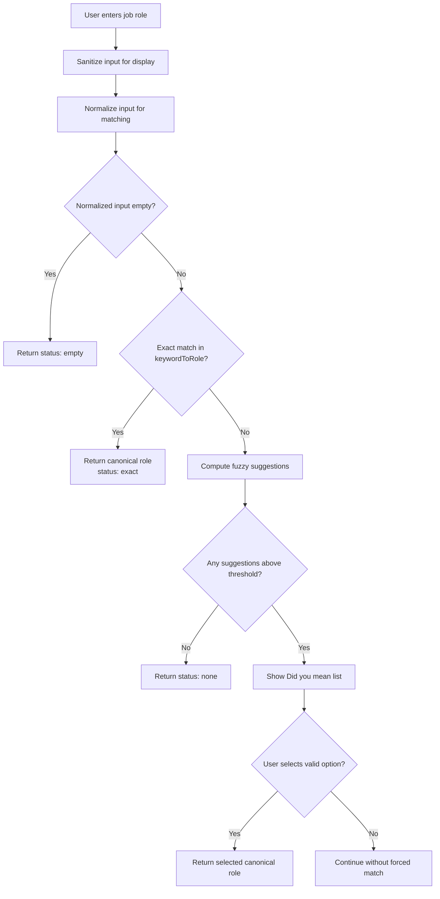
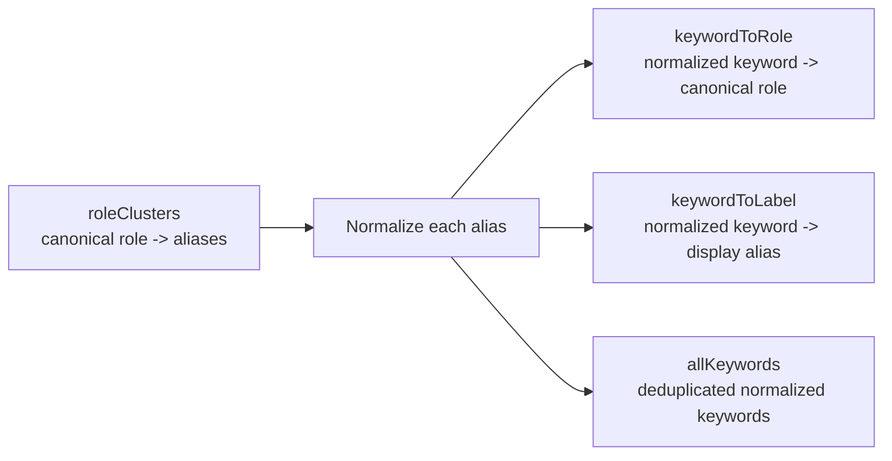
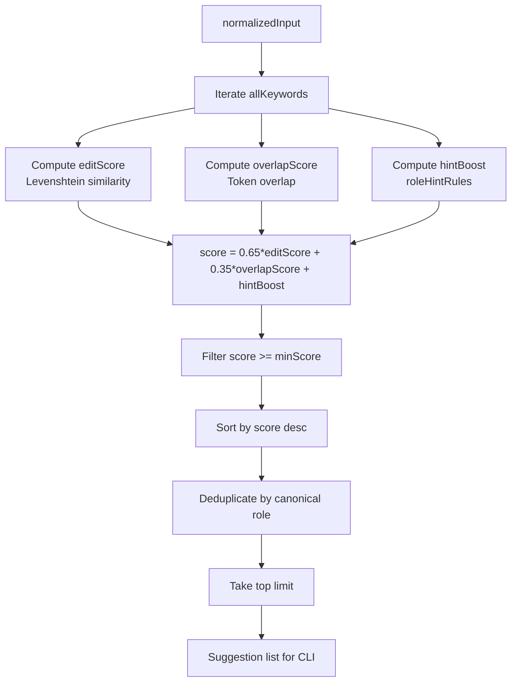
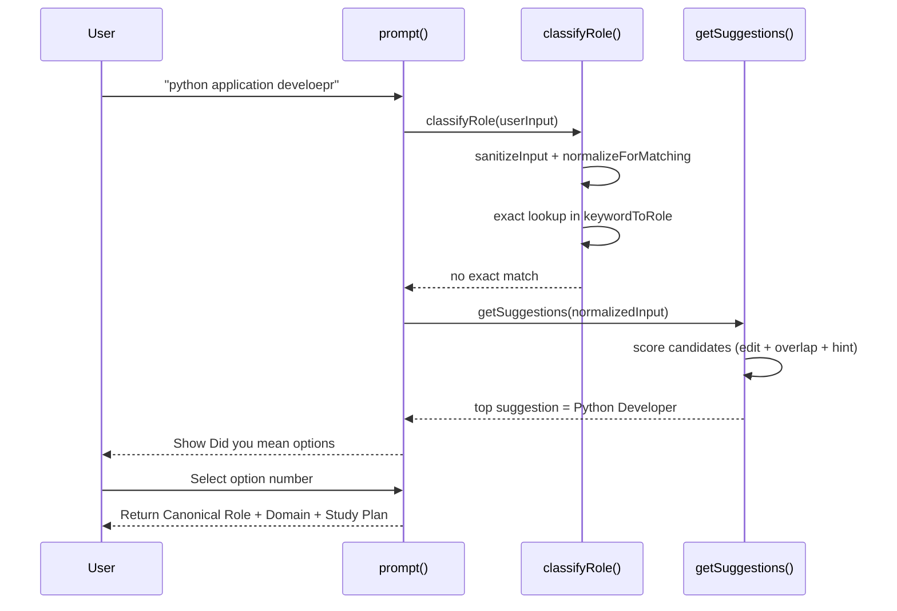

# IT Job Role Classifier - Detailed Workflow

## Overview
This classifier maps free-text job role input (including typos and aliases) to a canonical role.

Core goals:
- Group same role with multiple names (aliases).
- Split roles when expectations/study plans are different (for example, `Python Developer` vs `.NET Developer`).
- Provide interactive fallback suggestions when there is no exact match.

---

## End-to-End Flow

1. User enters a job role in the CLI.
2. Input is sanitized for display.
3. Input is normalized for matching.
4. Classifier checks exact normalized match in the role dictionary.
5. If exact match exists: return canonical role immediately.
6. If no exact match: compute ranked suggestions.
7. Show top suggestions in `Did you mean` list.
8. User selects an option number or skips.
9. Selected option is returned as final classification.

---

## Phase 1: Role Clusters (Source of Truth)

`roleClusters` is the canonical taxonomy.

- Key: canonical role name (for example, `Python Developer`).
- Value: list of aliases/synonyms/variants that should map to that same canonical role.

Design rules:
- Same expectation -> same cluster (many names, one role).
- Different expectation/study plan -> separate cluster.

Example:
- `Python Developer`, `Python Engineer`, `Django Developer` -> one canonical role.
- `.NET Developer`, `C# Developer`, `ASP.NET Developer` -> another canonical role.

---

## Phase 2: Normalization

`normalizeForMatching(raw)` converts both user input and cluster keywords into a common representation.

It handles:
- Lowercasing.
- Trimming extra spaces.
- Normalized aliases:
  - `dot net`, `dotnet`, `.net` -> `.net`
  - `c sharp` -> `c#`
  - `c plus plus` -> `c++`
  - `node js` -> `node.js`
- Stripping unsupported characters while preserving meaningful symbols (`.`, `#`, `+`, `-`).

Why this matters:
- Prevents mismatch due to punctuation/casing differences.
- Keeps technical tokens that are semantically important.

---

## Phase 3: Lookup Structures

From `roleClusters`, the script builds:

1. `keywordToRole`
- Maps normalized keyword -> canonical role.
- Used for exact match and suggestion resolution.

2. `keywordToLabel`
- Maps normalized keyword -> first human-friendly original alias.
- Used when displaying suggestion labels.

3. `allKeywords`
- Deduplicated list of normalized keywords.
- Used for ranking candidates in fuzzy suggestion flow.

All three are built in one pass over `roleClusters`.

---

## Phase 4: Exact Match First

`classifyRole(userInput)` starts with exact matching:

- `sanitized = sanitizeInput(userInput)` for display.
- `normalizedInput = normalizeForMatching(userInput)` for matching.
- If normalized input is empty -> status `empty`.
- If `keywordToRole[normalizedInput]` exists -> status `exact` and return result immediately.

This keeps confident matches deterministic and fast.

---

## Phase 5: Suggestion Ranking (No Exact Match)

If exact match fails, `getSuggestions(normalizedInput)` runs.

Candidate source:
- Suggestions are ranked from `allKeywords` (array), not directly from `keywordSet` (Set), because ranking requires array methods such as `.map()`.

### 1) Candidate scoring
Each keyword gets a combined score:

- Edit similarity score (Levenshtein-based)
- Token overlap score
- Language/stack hint boost (or penalty)

High-level formula:
- `score = 0.65 * editScore + 0.35 * overlapScore + hintBoost`

### 2) Language-aware hinting
`roleHintRules` improves ranking when input explicitly hints a stack:
- Example tokens: `python`, `.net`, `c#`, `java`, `node.js`, `golang`, etc.
- If hint matches candidate role: positive boost.
- If hint exists but candidate is generic (`Software Engineer` / `Backend Developer`) and not hint-aligned: small penalty.

### 3) Final suggestion list
- Filter by minimum score threshold.
- Sort descending by score.
- Deduplicate by canonical role (one suggestion per role).
- Return top `limit` suggestions.

---

## Function Objectives (Quick Map)

- `normalizeForMatching`: standardize user text and aliases into one comparable representation.
- `levenshteinDistance`: compute edit distance for typo tolerance.
- `tokenOverlapScore`: add phrase-level similarity beyond character distance.
- `getRoleHintBoost`: bias ranking toward stack-specific roles when language hints are present.
- `buildResult`: return a consistent result payload for exact matches.
- `getSuggestions`: rank fuzzy candidates and deduplicate by canonical role.
- `classifyRole`: orchestrate exact match first, then suggestion fallback.

---

## Phase 6: Interactive CLI Decision

In `prompt()`:

- If status is `exact`: print classification.
- If status is `suggestions`:
  - Print `Did you mean` options.
  - Ask for option number.
  - If valid selection: print selected role classification.
  - If invalid or blank: continue without forcing a match.
- If status is `none`: print unknown result.

This gives controlled human-in-the-loop fallback for ambiguous inputs.

---

## Output Contract

The current classification output includes:
- `Sanitized`
- `Canonical Role`
- `Domain`
- `Study Plan`

`Domain` and `Study Plan` come from role metadata (`roleProfiles`) when available; fallback behavior handles missing metadata safely.

---

## Why This Approach Works

- Reliable exact matching for known aliases.
- Better typo handling than raw string compare.
- Better relevance than plain edit distance due to token overlap + language hints.
- Clear user control when confidence is not high.
- Easy to extend by editing data (`roleClusters`, hint rules, profiles) without rewriting classifier logic.

---

## How to Extend

1. Add a new role
- Add a canonical role and aliases in `roleClusters`.
- Add optional metadata in `roleProfiles`.
- Add optional hint rule in `roleHintRules` for better ranking.

2. Improve normalization
- Add more normalization substitutions in `normalizeForMatching`.

3. Tune ranking behavior
- Adjust score weights (`0.65`, `0.35`).
- Adjust hint boost/penalty values.
- Adjust threshold (`minScore`) and number of suggestions (`limit`).

4. Add confidence auto-accept (optional)
- If top suggestion score crosses a high threshold, auto-select it and skip prompt.

---

## Example Walkthrough

Input:
- `python application develoepr`

Process:
1. Normalize input.
2. No exact normalized key found.
3. Rank all keywords.
4. Language hint `python` boosts Python-role candidates.
5. Top suggestion becomes `Python Developer`.
6. User selects option.
7. Final output returns canonical role + domain + study plan.

---

## Operational Notes

- Time complexity for suggestions is proportional to number of aliases in `allKeywords`.
- For very large taxonomies, consider:
  - Pre-indexing by tokens.
  - Limiting Levenshtein computations to prefiltered candidates.
  - Caching recent normalized inputs.
